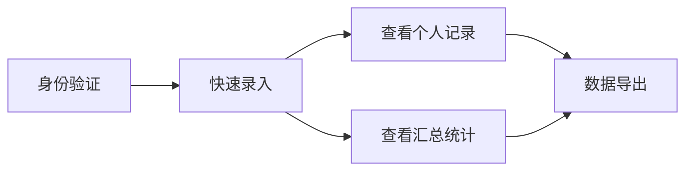

# 店铺收支管理系统 PRD

## 文档信息

| 项目 | 内容 |
|------|------|
| 项目名称 | 店铺收支管理系统 |
| 版本 | v1.0 |
| 创建日期 | 2024-04-15 |
| 产品类型 | 内部工具 |

---

## 1. 产品概述

### 1.1 项目背景

田林店目前使用Excel管理收支明细，自2024年4月开始记录，数据持续积累中。每月一个Sheet，记录每日收支流水。当前存在以下痛点：
- 需要在电脑上操作，手机端不便
- 多人协作困难，权限控制缺失
- 统计分析需要手动操作

### 1.2 产品目标

构建一个便捷的移动端收支管理系统，满足以下目标：
- 手机端快速录入收支数据
- 支持多人协作，每人只能修改自己的记录
- 按月、按年汇总统计，支持趋势图查看
- 数据安全，国内使用速度快
- 支持数据导出备份

### 1.3 技术方案

**选择方案**：飞书多维表格 + 小程序

| 组件 | 说明 |
|------|------|
| 后端 | 飞书多维表格（数据存储、权限控制、统计） |
| 前端 | 飞书小程序（录入界面、查看统计） |
| 账号体系 | 飞书账号（支持微信登录注册） |

### 1.4 用户规模

- 3-5人店铺员工

---

## 2. 用户旅程地图



---

## 3. 用户故事

---

## US-01: 记一笔（数据录入）

### 用户与场景

| 项目 | 内容 |
|------|------|
| 角色 | 店铺员工（3-5人） |
| 触发时机 | 发生任何收支时，需要立即记录 |
| 目标 | 快速录入单次或批量收支数据 |

### 业务规则与逻辑

#### 数据字段

| 字段 | 类型 | 说明 | 是否必填 |
|------|------|------|----------|
| 提交者 | 自动 | 飞书昵称，不可见不可改 | 是 |
| 提交时间 | 自动 | 精确到分钟，不可见不可改 | 是 |
| 收支类型 | 单选 | 收入 / 支出 | 是 |
| 分类 | 下拉选择 | 见下方分类列表 | 是 |
| 金额 | 数字 | 最大999999.99，默认整数 | 是 |
| 备注 | 文本 | 选"其他"时必填，最多200字 | 条件必填 |

#### 收支分类

```
收入分类：小确幸收入 | 美容收入 | 其他（需备注）

支出分类：电费 | 餐费 | 工资 | 房租预留 | 垃圾处理费 |
            业绩提成 | 手工提成 | 水光针头 | 其他（需备注）
```

#### 存储规则

- 每条记录独立一行
- 同次提交的记录用(提交者+提交时间)关联
- 未填写的槽位不存储

#### 金额输入规则

- 默认整数模式
- 用户输入小数点时才允许输入小数
- 支持最多2位小数

### 用户界面

#### 页面1：录入表单

```
┌─────────────────────────────────────────────────────────┐
│  📝 记一笔                                              │
├─────────────────────────────────────────────────────────┤
│  [隐藏字段: 提交者]      自动记录                         │
│  [隐藏字段: 提交时间]    自动记录                         │
│                                                          │
│  ┌───────────────────────────────────────────────────┐ │
│  │ 📌 第 1 条                                         │ │
│  │   收支类型:  ○ 收入   ● 支出                      │ │
│  │   分类选择:  [电费 ▼]                             │ │
│  │   金额:      [___________] 元                     │ │
│  │   备注:      [_________________________________] │ │
│  └───────────────────────────────────────────────────┘ │
│  （第2-5条同上格式）                                     │
│                                                          │
│            ┌─────────────────────────┐                  │
│            │       📤 提交            │                  │
│            └─────────────────────────┘                  │
└─────────────────────────────────────────────────────────┘
```

#### 页面2：提交成功

```
┌─────────────────────────────────────────────────────────┐
│                    ✅ 提交成功！                          │
│              成功记录了 3 条收支数据                      │
│  ✓ 支出 - 电费 - 500元                                   │
│  ✓ 收入 - 美容 - 200元                                   │
│  ✓ 收入 - 美容 - 150元                                   │
│  记录人: 小美  |  记录时间: 2024-04-15 14:32            │
│  ┌───────────┬───────────┬───────────────────────────┐ │
│  │📝 继续提交 │↩️ 返回修改 │ 📊 查看统计                │ │
│  └───────────┴───────────┴───────────────────────────┘ │
└─────────────────────────────────────────────────────────┘
```

### 验收标准

#### 正常场景

- 打开表单，显示5个空记录行
- 填写完整后点击提交，数据正确存入多维表格
- 提交者和提交时间自动记录
- 提交成功页面显示记录摘要
- 三个按钮功能正常：继续提交/返回修改/查看统计

#### 异常场景

- 必填项未填时，高亮提示，阻止提交
- 金额≤0时，提示"金额必须大于0"
- 选"其他"未填备注时，提示"备注为必填项"
- 全部为空时，提示"请至少填写一条记录"
- 网络异常时，提示用户并保留数据可重试

#### 边界条件

- 单条记录最大金额 999999.99 元
- 金额支持最多2位小数，默认整数模式
- 备注最多200字
- 单次提交最多5条记录

### 依赖关系

- 依赖飞书账号体系（用于自动获取提交者）
- 被以下故事依赖：US-02、US-03、US-04

---

## US-02: 查看我的记录

### 用户与场景

| 项目 | 内容 |
|------|------|
| 角色 | 店铺员工 |
| 触发时机 | 需要查看、修改或删除自己之前录入的记录 |
| 目标 | 管理个人录入的收支记录 |

### 业务规则与逻辑

#### 数据范围

| 筛选选项 | 说明 |
|----------|------|
| 最近30天 | 默认选项 |
| 全部记录 | 显示所有历史记录 |
| 自定义 | 用户选择起止日期 |

#### 权限控制

- 只能查看/编辑/删除**自己创建**的记录
- 不能看到其他人的记录

#### 数据分组

- 按(提交时间+提交者)分组
- 同批次记录可折叠/展开
- 每组显示提交时间和记录数量

#### 编辑规则

- 弹窗编辑
- 编辑后保存为新的修改记录

#### 删除规则

- 单条删除
- 需二次确认
- 删除后不可恢复

### 用户界面

#### 主页面：我的记录

```
┌─────────────────────────────────────────────────────────┐
│  < 返回            我的记录              [最近30天 ▼]   │
├─────────────────────────────────────────────────────────┤
│  ┌───────────────────────────────────────────────────┐ │
│  │ 📅 2024-04-15 14:32             (共3条)  [▼]     │ │
│  └───────────────────────────────────────────────────┘ │
│  ┌───────────────────────────────────────────────────┐ │
│  │ • 支出 - 电费 - 500元             [✏️ 编辑] [🗑 删除]│ │
│  └───────────────────────────────────────────────────┘ │
└─────────────────────────────────────────────────────────┘
```

#### 弹窗：编辑记录

```
┌─────────────────────────────────────────────────────────┐
│  编辑记录                                    ✕          │
├─────────────────────────────────────────────────────────┤
│  原记录：支出 - 电费 - 500元                             │
│  收支类型: ● 支出   ○ 收入                              │
│  分类: [电费 ▼]     金额: [500] 元                      │
│  备注: [4月电费________________]                         │
│  ┌─────────┬─────────┐                                  │
│  │  取消    │  保存    │                                  │
│  └─────────┴─────────┘                                  │
└─────────────────────────────────────────────────────────┘
```

#### 弹窗：删除确认

```
┌─────────────────────────────────────────────────────────┐
│  ⚠️ 确认删除                                  ✕          │
├─────────────────────────────────────────────────────────┤
│  确定要删除这条记录吗？此操作不可恢复。                   │
│  支出 - 电费 - 500元                                     │
│  ┌─────────┬─────────┐                                  │
│  │  取消    │ 确认删除 │                                  │
│  └─────────┴─────────┘                                  │
└─────────────────────────────────────────────────────────┘
```

### 验收标准

#### 正常场景

- 打开页面显示最近30天的个人记录
- 记录按提交时间分组，可折叠展开
- 可切换筛选条件（最近30天/全部/自定义）
- 编辑功能正常，保存后记录更新
- 删除功能正常，确认后记录被删除

#### 异常场景

- 无记录时显示空状态提示
- 编辑时必填项校验同US-01
- 网络异常时提示用户

#### 边界条件

- 单次最多显示100条记录
- 只能操作自己创建的记录

### 依赖关系

- 依赖 US-01（数据录入）
- 与 US-01 共享数据表

---

## US-03: 查看汇总统计

### 用户与场景

| 项目 | 内容 |
|------|------|
| 角色 | 所有员工（只读访问） |
| 触发时机 | 需要查看店铺整体收支情况 |
| 目标 | 了解经营状况，查看汇总数据和趋势 |

### 业务规则与逻辑

#### 统计指标

| 指标类型 | 具体指标 |
|----------|----------|
| 总览指标 | 总收入、总支出、结余、小确幸收入、美容收入 |
| 分类统计 | 各收入/支出分类的金额和占比 |
| 趋势分析 | 收支随时间的变化趋势 |
| 对比分析 | 月度/年度收支对比 |

#### 时间维度

| 选项 | 说明 |
|------|------|
| 最近7天 | 快速查看近期状况 |
| 最近30天 | 默认选项，查看月度概况 |
| 本月 | 查看自然月数据 |
| 本年 | 查看年度数据 |
| 自定义 | 用户选择起止日期，最多1年 |

#### 权限控制

- 所有员工可查看所有数据
- 只读访问，不可修改

#### 图表类型

- 折线图：收支趋势（收入/支出/结余）
- 饼图：支出分类占比、收入构成
- 柱状图：月度收支对比

### 用户界面

```
┌─────────────────────────────────────────────────────────┐
│  < 返回            收支统计              [最近30天 ▼]   │
├─────────────────────────────────────────────────────────┤
│  ┌───────────────┬───────────────┬─────────────────┐   │
│  │   总收入      │   总支出      │     结余         │   │
│  │   ¥45,866     │   ¥39,862     │   ¥6,004         │   │
│  └───────────────┴───────────────┴─────────────────┘   │
│  📈 收支趋势  📊 支出占比  🍩 收入构成  📊 月度对比       │
│  📋 分类明细 [展开 ▼]                                   │
└─────────────────────────────────────────────────────────┘
```

### 验收标准

#### 正常场景

- 打开页面显示最近30天的统计数据
- 5个核心指标正确计算和显示
- 4种图表正确渲染
- 切换时间范围，数据和图表自动更新
- 自定义日期范围功能正常
- 分类明细可展开/收起

#### 异常场景

- 所选时段无数据时显示提示
- 网络异常时提示用户重试

#### 边界条件

- 自定义日期最多查询1年
- 图表数据点自动调整密度

### 依赖关系

- 依赖 US-01（数据录入）
- 汇总所有用户的数据

---

## US-04: 数据导出

### 用户与场景

| 项目 | 内容 |
|------|------|
| 角色 | 所有员工 |
| 触发时机 | 需要备份数据时 |
| 目标 | 导出Excel文件进行备份 |

### 业务规则与逻辑

#### 导出规则

| 规则项 | 说明 |
|--------|------|
| 导出范围 | 所有历史数据 |
| 导出格式 | Excel (.xlsx) |
| 按钮位置 | 统计页面右上角 |
| 文件命名 | 田林店收支明细_YYYYMMDD_HHMM.xlsx |

#### 导出内容

| 字段 | 说明 |
|------|------|
| 日期 | 提交时间，精确到分钟 |
| 类型 | 收入/支出 |
| 分类 | 具体分类（电费/美容等） |
| 金额 | 数值，保留2位小数 |
| 备注 | 文本内容 |
| 提交者 | 飞书昵称 |

### 验收标准

#### 正常场景

- 点击导出按钮，显示加载提示
- 生成包含所有数据的Excel文件
- 文件自动下载到本地
- 显示导出成功提示和文件名
- Excel可正常打开，数据完整

#### 异常场景

- 无数据时提示"暂无数据可导出"
- 网络异常时提示"网络连接失败，请重试"
- 数据超过10万条时提示"数据量过大"

#### 边界条件

- 最多导出10万条记录
- 导出频率无限制

### 依赖关系

- 依赖 US-03（统计页面）
- 导出所有用户数据

---

## 4. 非功能需求

### 4.1 性能要求

| 场景 | 要求 |
|------|------|
| 打开页面 | < 2秒 |
| 提交数据 | < 3秒 |
| 导出Excel | < 10秒（10万条以内） |

### 4.2 安全要求

- 所有员工通过飞书账号登录
- 数据存储在飞书云端，加密传输
- 每人只能修改自己的记录

### 4.3 兼容性要求

- 支持飞书App（iOS/Android）
- 支持飞书小程序
- 支持主流浏览器访问

---

## 5. 数据模型

### 5.1 数据表结构

```
收支记录表
├── 提交者（飞书昵称）
├── 提交时间（日期时间）
├── 收支类型（枚举：收入/支出）
├── 分类（枚举）
├── 金额（数字）
└── 备注（文本）
```

---

## 6. 飞书配置清单

| 配置项 | 说明 |
|--------|------|
| 多维表格 | 创建收支记录表 |
| 表单视图 | 创建录入表单 |
| 权限设置 | 创建者可编辑，其他人只读 |
| 仪表盘 | 创建统计图表 |
| 小程序 | 开发录入和查看界面 |

---

## 7. 附录

### 7.1 术语表

| 术语 | 说明 |
|------|------|
| 小确幸收入 | 店铺基础服务收入 |
| 美容收入 | 美容业务收入 |
| 同批次记录 | 同一次提交的多条记录 |

### 7.2 变更记录

| 版本 | 日期 | 变更内容 | 作者 |
|------|------|----------|------|
| v1.0 | 2024-04-15 | 初始版本 | Claude |
